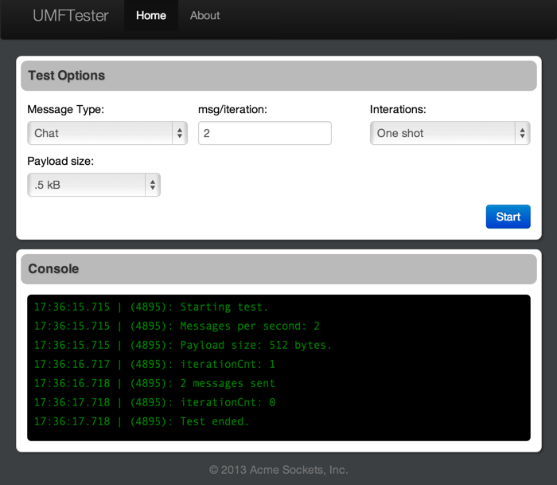

# umf_router

# WebSocket Universal Message Router
umf_router is a Python/Flask server application which uses gevent and gevent-websocket to handle WebSocket messages which are formatted using a JSON message format called UMF.
This application is a proof-of-concept for bidirectional message passing via WebSockets.

[UMF Documentation](./docs/UniversalMessagingFormat.md)

Note: above link doesn't work under Atlasian Stash Repos. Also, Stash doesn't currently render mark down files other than the default README.md
The file can be found in docs/UniversalMessagingFormat.md

This project also includes a single page application (SPA) tester written using AngularJS. The tester is called UMFTester and can be used to fire messages at the Flash-based UMFRouter.

# UMFTester screenshot

# TODOs
This entire application is simple a websocket proof of concept, however there are still a lot of things that can be added to improve it.

* More tests! The UMFRouter could use more Python unitest and the UMFTester (the JavaScript SPA) could use a lot more Jasmine BDD tests.
* More test messages. Currently only two messages are implemented, chat and heartbeat message.
* A feature where the umf_router sends messages to clients to simulate message broadcasts

